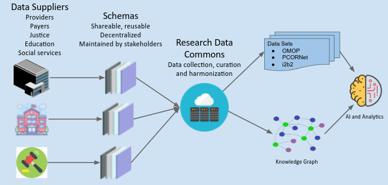
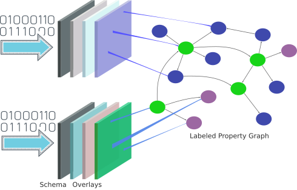
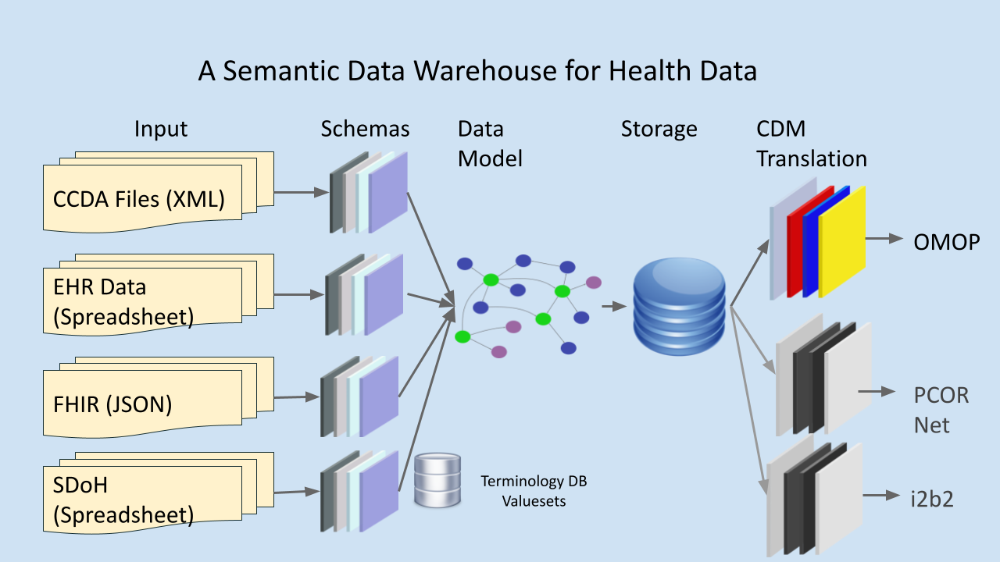

# Semantic Interoperability for Electronic Health Data Using the Layered Schemas Architecture

This repository contains the artifacts for the ONC LEAP Project titled
"Semantic Interoperability for Electronic Health Data Using the
Layered Schemas Architecture". For more information, questions, and
support, contact:

 * [DARTNet Institute](https://dartnet.info/contact.htm)
 * [Cloud Privacy Labs](https://cloudprivacylabs.com/)

The project's vision is to build an integrated ecosystem of tools and
technologies that connect and harmonize health and health-related data
obtained from organizations of all sizes, as well as individuals,
supported by a person-centric and privacy-conscious approach to data
access and sharing among patients, clinical settings, and researchers.



All data files included in the repository are synthetic data files.

## Introduction

The longitudinal health data from large diverse populations with
varying social, economic, geographic, and environmental conditions is
a highly valuable resource for medical and public health researchers
through the creation of various data commons where disparate data are
structured and harmonized to expand research options. Many challenges
hinder the complete and efficient capture and exchange of health data,
including:

  1. a lack of semantic interoperability across systems
  2. the varying adoption of data standards within and between systems
  3. a lack of standardized metadata, and
  4. the poor integration of electronic health records (EHR) data with data from other relevant
sources such as social services, environmental measurements,
patient-entered, and data collected from wearable devices.

EHR data can be highly variable between different sources and even
within a single EHR system, due to the differences between EHR
vendors, data models, and underlying data codification approaches; as
well as institutional conventions, and end users’ data capture
decisions amongst many other reasons. Customized
Extraction-Transformation-Loading (ETL) pipelines are the key for
semantic harmonization in a traditional data warehousing
operation. However, these data transformations are usually lossy, even
if not intended to be so, because of inexact mapping of semantics to
the target data model. The process does not scale well when numerous
data sources are involved as it requires many customizations that are
specific to a particular problem, location, and/or data source.

This project uses layered schemas as a scalable semantic harmonization
solution for data warehousing applications. Layered schemas technology
consists of a schema base that represents core attributes of the
captured data, along with multiple interchangeable overlays that
represent variations due to different EHR vendors, jurisdictions, or
organizational conventions. A layered schema also defines a mapping
between the input data elements and an abstract data model represented
as a labeled property graph. The annotated graph representation can be
transformed into a common data model or used directly, such as into a
training data set for an AI application using the source data and the
metadata associated with it.

## Layered Schemas

A **schema** is a machine-readable document that describes the
structure of data. JSON and XML schemas are widely used to generate
executable code from specifications and to check structural validity
of data. LSA extends schemas (such as FHIR or OMOP schemas) with
layers (overlays) to add semantic annotations. The semantic
annotations add ontology mappings, contextual metadata, tags, and
processing instructions that control data ingestion and
normalization. A **schema variant** is composed of a schema and a
set of overlays, and contains the combination of annotations given in
the schema and the overlays.

A schema variant is represented using a **labeled property graph**
(LPG) that has a node for each data field. An LPG is a directed graph
where every node and edge contain a set of **labels** describing its
type or class, and a set of **properties** that represent named
values. An LPG allows assigning tags that represent different types of
metadata to fields. A field may be a simple value, a structured object
(e.g a JSON object, array, polymorphic object), or a reference to
another schema.



Different schema variants can be used to ingest data that shows
variations depending on the data source. Data variations can be
structural (e.g. additional data fields, extensions) or semantic
(e.g. measurements in different units, different ontologies or coding
systems), and can be due to different vendor implementations, local
conventions, or regulations. Ingesting structured data using a schema
variant creates an LPG whose nodes combine the annotations from the
schema variant and data values from the input.

## Layered Schemas for Interoperability

The focus of layered schema architecture is achieving interoperability
in an environment with multiple data standards. These standards can be

  * structural, such as data represented as a FHIR message, or CCDA,
  * representational, e.g. different date formats, data entry conventions,
  * semantic, e.g. different coding systems, measurement units.

The goal is **not** to ingest and normalize data with an ETL process,
but to ingest data verbatim with annotations that capture context and
metadata. The actual interpretation of data happens closer to the
analytics side of the process.

Structural differences in ingested data are solved using labeled
property graphs as the core data model. A labeled property graph
allows storing individual data elements and the relationships between
those data elements together with semantic annotations. Data is
ingested using a layered schema describing the input data elements,
and converted into an LPG. Then source-specific transformations are
performed on that LPG to map it to a graph model. The schemas and the
transformations used to process the input can be reused and shared.

Representational differences are solved using a type system built into
the layered schema tools, and valueset lookups. For example, the input
may contain a date field:

```
   dob
----------
2001-01-04
```

The schema that ingests this field can be defined as:

```
"birthDate": {
  "@type": "Value",
  "valueType": "xs:date",
  "attributeName": "dob"
}
```

`xs:date` is the XML date format that says the date is of the form
`YYYY-MM-DD`, Which causes the field to be ingested as as graph node:

```
+-----------------------+
|   :Value              |
+-----------------------+
| id: birthDate         |
| valueType: xs:date    |
| attributeName: dob    |
| value: 2001-01-04     |
+-----------------------+
```
When data is extracted from this node using a schema that looks like:

```
"birthYear": {
  "@type": "Value",
  "valueType": "xs:gYear"
```

where `xs:gYear` is the XML data type "Gregorian Year", the output will be:

```
birthYear
--------
2001
```

So the ingestion phase ingests data with type information, and when
exported using a different type, it is converted if possible.

[This is the complete set of data types supported by LSA.](https://layeredschemas.org/docs/data_types/)


Data entry and data capture conventions for enumerated data may
require dictionary lookups to correctly interpret data. For example,
one data source may report:

```
gender
------
F
M
```

and another may report:

```
gender
-----
Female
Male
```

This can be modeled using a schema:

```
"gender": {
   "@type": "Value",
   "attributeName": "gender"
}
```

And an overlay for data source 1 with:

```
"gender": {
   "@type": "Value",
   "vsValuesets": "gender_source_1",
   "vsResultValues": [ "normalized_gender"]
},
"normalizedGender": {
   "@type": ["Value","OMOPConcept"]
}
```

And a valueset:

```
{
  "id": "gender_source_1",
  "values": [
      {
         "values": ["F"],
         "result": "8532"
      },
      {
         "values": ["M"],
         "result": "8507"
      }
    ]
}
```

And for data source 2 with:

```
"gender": {
   "@type": "Value",
   "vsValuesets": "gender_source_2",
   "vsResultValues": [ "normalized_gender"]
},
"normalizedGender": {
   "@type": ["Value","OMOPConcept"]
}
```

```
{
  "id": "gender_source_1",
  "values": [
      {
         "values": ["Female"],
         "result": "8532"
      },
      {
         "values": ["Male"],
         "result": "8507"
      }
    ]
}
```

The codes 8532 and 8507 are OMOP concept IDs for "female" and "male".

The ingested data becomes:

```
+-----------------------+   +-----------------------+
|   :Value              |   | :Value:OMOPConcept    |
+-----------------------+   +-----------------------+
| id: gender            |   |id: normalizedGender   |
| attributeName: gender |   |value: 8532            |
| value: F              |   |                       |
+-----------------------+   +-----------------------+

```

```
+-----------------------+   +-----------------------+
|   :Value              |   | :Value:OMOPConcept    |
+-----------------------+   +-----------------------+
| id: gender            |   |id: normalizedGender   |
| attributeName: gender |   |value: 8532            |
| value: Female         |   |                       |
+-----------------------+   +-----------------------+

```

Such lookups allow creation of codified nodes as data is
ingested. This way, the stored data contains both the raw input and
the concept normalized based on a terminology. Multiple terminologies
can also be used. The data model is not strict and can be extended
ad-hoc as needed.

Such valueset lookups are feasible for a small number of
options. There are cases where an terminology database is needed. The
LSa tooling provides facilities to call out to third-party servers to
perform terminology lookups. 

## Data Flow Overview

The overall process of ingestion, harmonization, and the extraction of
data in a common model is depicted in the following diagram. This
project primarily works with OMOP, but the model is flexible enough to
be adapted to other common data models.



The input to the ingestion process contains support for the following
data formats:

 * FHIR data in JSON format. Every patient record is a FHIR Bundle
   resource stored in a separate JSON file.
 * CCDA data in XML format. Every patient record is a separate XML
   file.
 * Raw EHR data in CSV format. This data files are obtained by running
   EHR reports, thus show a great deal of structural and semantic
   variability. There are usually multiple files, each representing a
   single object (like patient, or measurement), but there are cases
   where the result of a SQL JOIN is provided as a single file.

For most CSV data, we write custom schemas to describe the input
format.  For CCDAs, we developed a set of interlinked schemas and
overlays to extract relevant parts of a CCDA document. FHIR ingestion
uses HL7 published FHIR schemas with additional overlays to link
vocabulary lookups, type variations, and other processing directives.
Then, data files are ingested and converted into labeled property
graph form.

For FHIR and CCDA files, a single file can generate a graph containing
all the necessary elements. For CSV files, each row usually contains a
single data object (like a patient, or an observation for a
patient). Thus, when ingested, these records must be linked to form a
common patient view. This linking is done by using special annotations
on the schemas. For instance, the schema for an observation table
contains a foreign key to the patient table.

The harmonization process does **not** normalize the data elements to
a common format. Instead, input data elements are tagged with type
information and additional annotations that describe how they can be
interpreted.

Once ingested, all data elements are harmonized and translated into an
intermediate graph model. This graph model is not a strict structural
construct. The model is Person centric, and contains the following
elements:

 * Person: Demographic information and identity
   * Condition: Multiple conditions are linked to a Person. Condition
     entries include start/end dates, raw input data, and
     codifications.
   * DrugExposure: All drug related activity is recorded
     here. Multiple DrugExposure entries are linked to a Person.
   * Measurement: All laboratory measurements are recorded
     here. Multiple measurement entries are linked to a Person. The
     same measurement may appear multiple times, in different dates.
   * Observation: All observations are recored here. Multiple
     observation entries are linked to a Person.
   * Procedure: All procedures are recoded here. Multiple procedure
     entries are linked to a Person.

The graph model is stored in a graph database. This project uses Neo4j
community version to store the ingested data, but other graph
databases that have openCypher support can be adapted as well. It is
also possible to change the data ingestion pipelines so that a
relational database, or a document database can be used to store data.

OMOP output is generated from this data model by mapping individual
fields to OMOP schema fields.

## Building and Running the Tools

This repository contains a `pipeline` program that can be built and
used to ingest data contained in this repository. You can get a
pre-built binary for your platform, or build it yourself using the Go
language build system.

To build, after cloning this repository, run:

```
cd pipeline
go build
```

This will build the `pipeline` binary in the current directory.

## Acknowledgments

This project is supported by the Office of the National Coordinator
for Health Information Technology (ONC) of the U.S. Department of
Health and Human Services (HHS) under grant number 90AX0034, Semantic
Interoperability for Electronic Health Data Using the Layered Schemas
Architecture, total award $999,990 with 100% financed with federal
dollars and 0% financed with non-governmental sources. This
information or content and conclusions are those of the author and
should not be construed as the official position or policy of, nor
should any endorsements be inferred by ONC, HHS, of the
U.S. Government.
